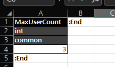
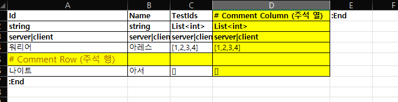
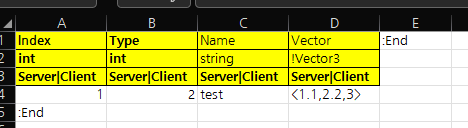
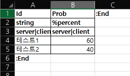
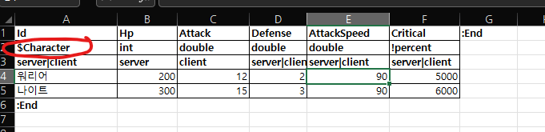
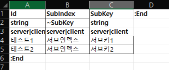

# ExcelToDotnet

## Nuget.org

<https://www.nuget.org/packages/ExcelToDotnet/>

## introduce

### English

Excel To Dotnet Compatible Data (Enum, Class, JSON)

It can be said to be a converter that can be used in Unity, C# applications, etc.

An Excel Sheet with a set rule is required.

In the case of Enum, only the Enum sheet must be registered. Otherwise, the sheet name becomes the class name.

In all cases, # is used as a comment (table, column, etc.).

In case of Enum, start :Begin and end point should be :End.

In the case of a table, the first row must be the column name, and the end point must be specified with :End.
The second row is the data type, and it is possible to link to the Id column of another table with $. 

### Korean

Unity, C# 애플리케이션 등에서 사용할 수 있는 변환기라고 할 수 있습니다.

규칙이 설정된 Excel 시트가 필요합니다.

Enum의 경우 Enum 시트만 등록해야 합니다. 그렇지 않으면 시트 이름이 클래스 이름이 됩니다.

모든 경우에 #은 주석(테이블, 열 등)으로 사용됩니다.

Enum의 경우 시작 :Begin, 끝점은 :End여야 합니다.

테이블의 경우 첫 번째 행은 열 이름이어야 하며 끝점은 :End로 지정해야 합니다.
두 번째 행은 데이터 타입으로 $로 다른 테이블의 Id 컬럼과 연결이 가능 합니다. 

# Excel Keyword Introduce (English)

## Table Name (Sheet Name) Reserved Keyword

### # (Comment)
comment or description

### ! (ignore)
ignore id column check

## Data Type Reserved Keyword

### # (Comment)
comment or description

### ! (ignore)
ignore type check (Custom DataType) 

### % (Percent)
It should be 100 when summing the row values. dataType double

### $ (Reference)

Refers to the key of the sheet (table) of the string following $. (Error if associated value does not exist

### ~ (SubIndex)

cleanup & generate all option.

This is a function to check for duplicates within a table using the same index by placing a secondary index.

# 테이블명(시트명) 예약어

## # 설명

코멘트 또는 설명

시트 변환을 시도하지 않고 참조용 페이지에서 사용해주세요.

## ! 무시하다

Id 컬럼 존재 여부 확인 무시

위와 같이 테이블명 (시트명)에 사용시, Id 컬럼에 대한 체크를 무시합니다.

## Const{테이블명}

상수 값에 대한 기능으로, Id 컬럼에 대한 유효성 검사를 하지 않습니다.

위와 같이 Id 컬럼이 없어도 사용 가능합니다. ! 키워드와 동일한 동작입니다.

# 데이터 타입 예약어

## # 설명

코멘트 또는 설명

행이나 열에 사용시, 해당 행이나 열은 모두 주석으로 인식됩니다.

## ! 무시하다

primitive type이 아닌, using을 통해 각종 내장 타입 혹은 외부 미리 선언된 타입을 사용하고자 할 경우 사용 (Custom DataType)

!Vector3 가 예시이며, Vector3를 System.Numerics.Vector3를 사용하기 위해서 ! 키워드를 앞에 붙임으로써, 타입 검사를 무효화 하는 기능입니다.

이 기능은 남발 할 경우, 서버나 클라이언트 컴파일 오류로 이어질 수 있으므로 주의 해야 합니다.

## % 퍼센트

행 값을 합산할 때 100이어야 합니다.

행의 총 합을 계산해서, 100인지 아닌지를 검사하는 기능입니다.

## $ 참조

$ 뒤에 오는 문자열의 시트(테이블)의 키를 참조합니다. (연결된 값이 해당 테이블에 없으면 오류)

특정 컬럼이, $이후에 쓰인 문자열에 해당하는 테이블에 존재하는지 확인하는 기능입니다.

예시는 Id 컬럼에 대해서 참조 값으로 사용했는데요, Id컬럼이 아닌 일반 컬럼에서도 사용 가능합니다.

## ~ 보조 인덱스

모든 옵션을 정리하고 생성합니다.

보조 인덱스를 배치하여 동일한 인덱스를 사용하는 테이블 내에서 중복 여부를 확인하는 기능입니다.

위 예시는 SubIndex가 같은 값인 행에 대해서, SubKey에 대해 중복 검사를 해준다는 의미입니다.

예를 들어, 특정 스테이지에 대한 보상을 지급 할 때, 동일한 스테이지에서는 동일한 보상을 선택하지 않게 하고 싶을 때 사용하시면 됩니다.

## Sample Excel (xlsx)

<https://github.com/elky84/ExcelToDotnet/blob/main/ExcelCli/Character.xlsx>

## add package

`dotnet add package ExcelToDotnet`

## Implment CLI. (link ExcelToDotnet)

Release: <https://github.com/elky84/ExcelToDotnet/releases>

Reference : <https://github.com/elky84/ExcelToDotnet/blob/main/ExcelCli/Program.cs>, <https://github.com/elky84/ExcelToDotnet/blob/main/ExcelCli>

## install cli global tool

require dotnet 6 (LTS) or later (<https://dotnet.microsoft.com/en-us/download>)

`dotnet tool install -g ExcelCli`

## global tool usage

execute command name is `excel2dotnet`

### use single excel file (-f)
`excel2dotnet -f {fileName}`

### use target directory (-d)
`excel2dotnet -d {directory}`

### use enum generate mode (-e)
`excel2dotnet -d {directory} -e`

### use validation mode (-v)
`excel2dotnet d {directory} -v`

### use nullable mode (-l) => for .NET 6 or later
`excel2dotnet d {directory} -l`

## Execute CLI options (execute build file)

execute file name `excel2dotnet` instead of `ExcelCli`

### all options
- <https://github.com/elky84/ExcelToDotnet/blob/main/ExcelToDotnet/Options.cs>

## Version History

### v1.0.24
* Fixed Validation Failed Exit Code. (0x0 -> 0x4)

### v1.0.23
* Support System.Numerics Vector2 and Vector3

### v1.0.22
* Table EndsWith mark location to StartsWith.

### v1.0.21
* support custom table type. (use with '!')

### v1.0.20
* generate class to partial class

### v1.0.19
* removed ignore mode
* added wide mode (cleanup & generate all option)
* fixed sub index, probability functions.
